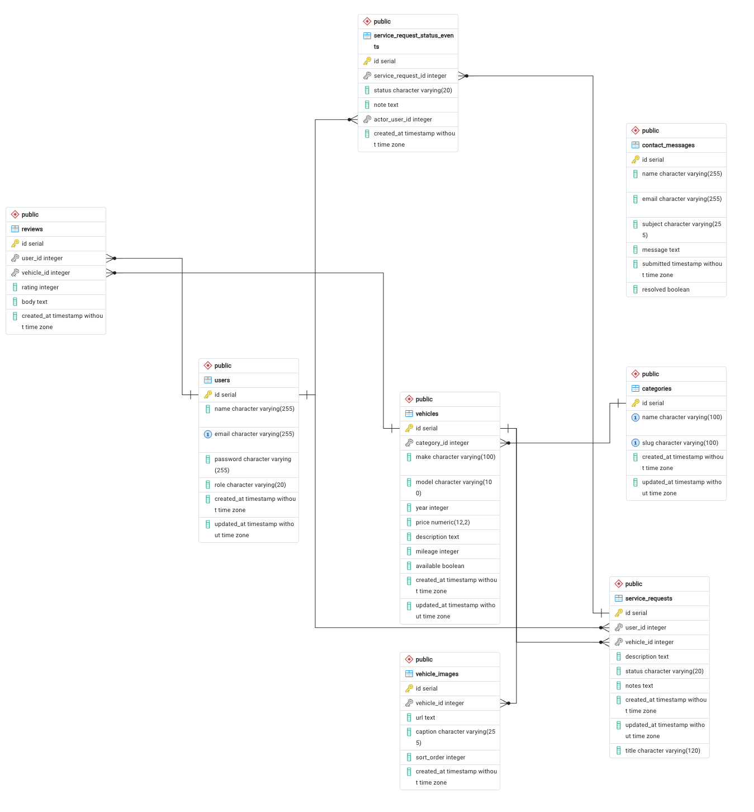

# Honest Auto

## Project Description

A full-stack, server-side rendered web application for a used car dealership. Visitors can browse vehicle inventory by category, view individual vehicle detail pages, and submit contact inquiries. Registered users can leave reviews on vehicles and submit service requests for their vehicles. Employees and owners have access to management dashboards for handling inventory, reviews, service requests, and contact submissions.

## Tech Stack

- Node.js with Express.js
- EJS for server-side rendering
- PostgreSQL for the database
- Session-based authentication with express-session
- Deployed on Render

## Database Schema

Entity-relationship diagram for the PostgreSQL schema (users, vehicles, categories, reviews, service requests, and related tables).



## User Roles

**Owner**  
The owner has full administrative control over the system. This includes adding, editing, and deleting vehicle categories and inventory, adding/editing vehicle images, managing employee accounts, viewing all user data, and performing every action available to employees.

**Employee**
Employees can edit vehicle details such as price, description, and availability. They can also moderate and delete inappropriate reviews, view and manage all service requests, update service request statuses (Submitted, In Progress, Completed), add notes to service requests, and view contact form submissions.

**Standard User**
Registered users can leave reviews on vehicles and edit or delete their own reviews. They can also submit service requests for their vehicles and view the status and history of their submitted requests.

## Test Account Credentials


| Role     | Email                                                     |
| -------- | --------------------------------------------------------- |
| Owner    | [owner@dealership.com](mailto:owner@dealership.com)       |
| Employee | [employee@dealership.com](mailto:employee@dealership.com) |
| User     | [user@dealership.com](mailto:user@dealership.com)         |


## Known Limitations

- If `public/images/ERD.png` is missing from the repository, the diagram will not render on GitHub.
- Service request updates currently rely on manual status changes by employees/owners and do not include automatic notifications to users.

## Repository Structure

Application code lives under `src/`. Static assets (CSS, images) are in `public/` at the repository root and are served from the site root (for example `/css/style.css`). `node_modules/`, `.env`, and `package-lock.json` are gitignored and are created or supplied when you run `npm install` and configure your environment.

```
.
├── .gitignore
├── README.md
├── requirements.md
├── nodemon.json
├── package.json
├── public/
│   ├── css/
│   │   └── style.css
│   └── images/              # static assets (e.g. ERD.png, vehicle photos)
└── src/
    ├── bin/                 # Postgres TLS certificate (used by models/db.js)
    ├── config/
    ├── controllers/
    ├── middleware/
    ├── models/
    ├── routes/
    ├── server.js            # application entry (see package.json scripts)
    ├── sql/
    │   ├── schema.sql
    │   └── seed.sql
    ├── utils/
    └── views/
        ├── auth/
        ├── contact/
        ├── dashboard/
        │   ├── employee/
        │   └── owner/
        ├── errors/
        ├── home/
        ├── layouts/
        ├── partials/
        │   ├── category-admin-script.ejs
        │   ├── dashboard-messages.ejs
        │   ├── flash.ejs
        │   ├── footer.ejs
        │   ├── header.ejs
        │   ├── nav.ejs
        │   └── review-form.ejs
        ├── reviews/
        ├── user/
        └── vehicles/
```

## Getting Started

1. Clone the repository
2. Run `npm install` to install dependencies
3. Add a `.env` file with your database credentials, session secret, and any other required variables
4. Run `npm run dev` for local development (nodemon reloads on changes), or `npm start` to run the app with Node directly

## Live Deployment (Production URL)

> [https://honestauto.onrender.com/](https://honestauto.onrender.com/)

